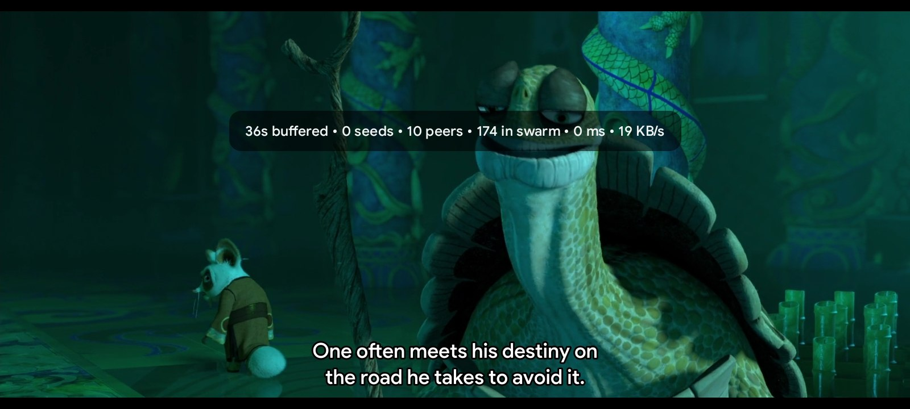
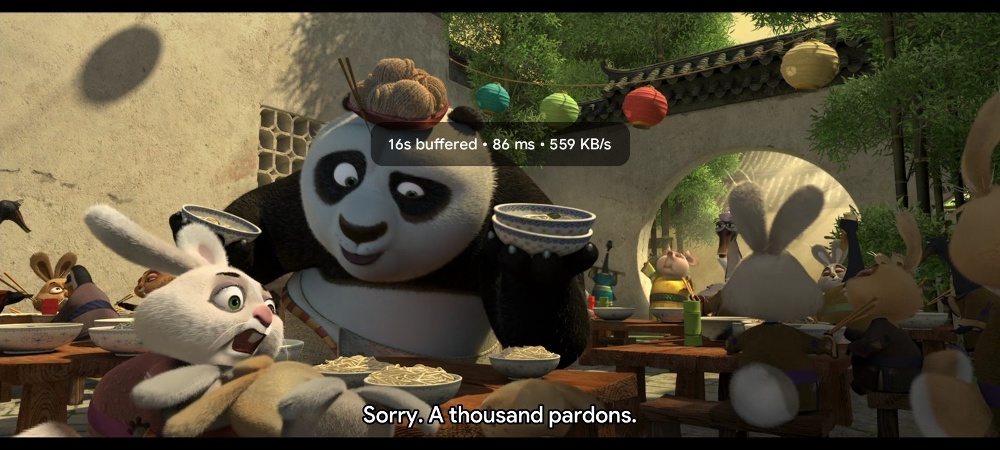
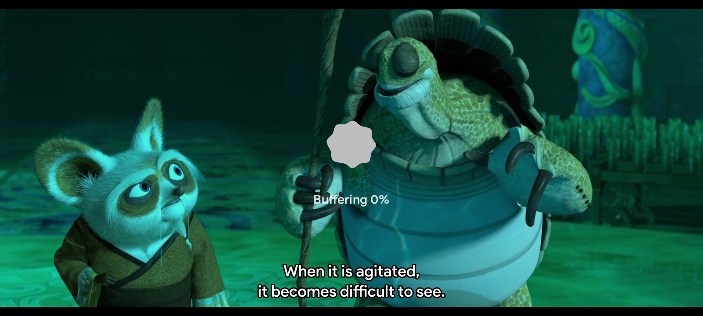

# mpvRex — Stremio Edition

  

  <b>A Stremio-focused build of the libmpv-based Android video player.</b>

  
  
  
  

---

## 🎯 About This Project

This repository is a **fork of [mpvRex](https://github.com/sfsakhawat999/mpvRex)**,
the feature-rich Android video player built on libmpv with a modern Jetpack Compose
interface. This edition was created for users who experience problems with
[Stremio](https://www.stremio.com/)'s built-in players — such as playback stuttering,
subtitle issues, codec failures, or general instability — and want a more reliable
external playback experience.

When you open a stream from [Stremio](https://www.stremio.com/), this player handles
the handoff seamlessly: it picks up the exact resume position, reports progress back
to [Stremio](https://www.stremio.com/)'s Continue Watching list, and keeps your
watch history in sync.

This fork also works perfectly as a **standalone Android video player**. If you do not
use [Stremio](https://www.stremio.com/) at all, you still get a powerful, gesture-driven
mpv-based player with auto subtitle loading, honest buffering, and modern Material You
design. If you prefer the original experience without Stremio-specific additions, the
main [mpvRex](https://github.com/sfsakhawat999/mpvRex) remains an excellent choice.

---

## 📸 Showcase

  
  
<i>P2P Stream Info — live peer, seed, swarm, ping, and speed data</i>

  
  
<i>HTTP Stream Info — buffered seconds, live ping, and download speed</i>

  
  
<i>Honest Buffering Percentage — see exactly how much is loaded</i>

---

## 🔧 Important [Stremio](https://www.stremio.com/) Settings

For reliable external playback from [Stremio](https://www.stremio.com/), open
[Stremio](https://www.stremio.com/)'s settings and configure the following:

| Setting | Value |
|---|---|
| **Local streaming server** | `http://127.0.0.1:11470/` |
| **Run in background** | ✅ Enable |

These two settings ensure that [Stremio](https://www.stremio.com/) keeps its local
streaming server running while mpvRex handles playback, so streams load instantly
and resume positions stay synchronized.

---

## ⚡ Extra Features

Compared with the original mpvRex, this build adds:

### 🔄 Perfect [Stremio](https://www.stremio.com/) Continue Watching Sync

Playback starts from the **exact position** supplied by [Stremio](https://www.stremio.com/).
When you close the player, progress is reported back immediately. Your
[Stremio](https://www.stremio.com/) Continue Watching list stays accurate — no more
restarting episodes from the beginning or losing your place. The synchronization is
tight and reliable: open a stream, watch, close, and [Stremio](https://www.stremio.com/)
knows exactly where you left off.

### 📡 Live Stream Information

A dedicated overlay presents real-time network details while a stream is playing.

**P2P streams** show:
- **Buffered seconds** — how much content is ready ahead of the playhead
- **Peers** — number of connected peers transferring data to you
- **Seeds** — number of seeders available in the swarm
- **Swarm** — total size of the peer swarm
- **Live ping** — current round-trip latency to the tracker/swarm
- **Live speed** — real-time download throughput

**HTTP streams** show:
- **Buffered seconds** — content loaded ahead of the playhead
- **Live ping** — current server latency
- **Live speed** — real-time download throughput

The overlay appears automatically during startup and can also be opened manually
with the information button.

### 📊 Honest Seekbar Buffering

The seekbar reports **how much content is actually buffered** instead of displaying
an inaccurate full buffer. During loading, a clear buffering percentage gives you
a realistic view of playback readiness — you always know how close you are to
smooth playback.

### 🎬 Auto Load Subtitles

When playing a local file that does not contain embedded subtitles, mpvRex can
**automatically search online** for a matching subtitle and load it into playback.
You can enable or disable this feature at any time.

If you want finer control, you can **blacklist specific folders** — files in those
directories will never trigger an automatic subtitle search. This is useful for
folders containing concert recordings, screen captures, or other media where
subtitles are irrelevant.

> ⚠️ **This feature requires a Wyzie API key.**
> You can redeem a free key at the [Wyzie Store](https://store.wyzie.io/redeem).

If the stream already has **embedded subtitles**, mpvRex will **not** search online
for additional subtitles — it respects what is already in the file. A **manual
subtitle search** is always available if you want to find a different language or
alternative translation.

---

## 📦 Releases

All pre-built APKs and release notes are published in the
[Releases section](https://github.com/mezbahzaman/mpvRex/releases).

---

## 🔨 Building from Source

Follow the original project's build instructions; this fork adds no new build
dependencies or steps.

---

## 🙏 Credits

This project stands on the shoulders of several incredible open-source efforts.
We are deeply grateful to every contributor who made this possible.

**[mpvRex](https://github.com/sfsakhawat999/mpvRex)** — the original feature-rich
Android video player built on libmpv with a modern Jetpack Compose interface. The
entire base structure, UI framework, gesture system, and playback engine come from
this project. Without it, this fork would not exist. Thank you to
**[sfsakhawat999](https://github.com/sfsakhawat999)** and every contributor to
mpvRex for building something worth extending.

**[mpvEx](https://github.com/marlboro-advance/mpvEx)** — the predecessor that
established the libmpv integration pattern for Android, laying the groundwork that
mpvRex and this edition build upon.

**[mpv-android](https://github.com/mpv-android/mpv-android)** — the official
Android port of mpv, providing the native playback core that powers every stream
and local file in this player.

Additional inspiration and reference:
[mpvKt](https://github.com/abdallahmehiz/mpvKt) ·
[Next Player](https://github.com/anilbeesetti/nextplayer) ·
[Gramophone](https://github.com/FoedusProgramme/Gramophone)

---

## 📜 License

Apache License 2.0. Original work by the
[mpvRex](https://github.com/sfsakhawat999/mpvRex) authors; this fork adds
[Stremio](https://www.stremio.com/)-specific patches on top.
